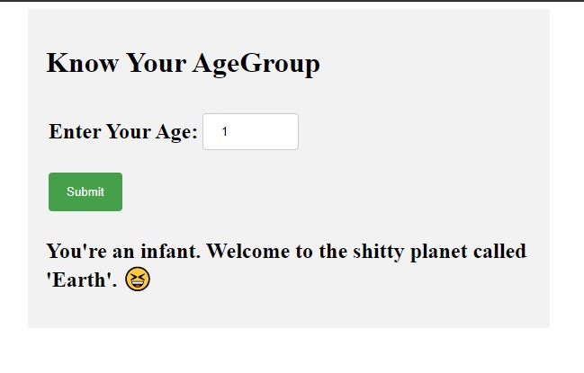

# KnowYourAgeGroup-JS-

A simple age group categorizing funny app developed using html, css and js. 

**How to use?**

1. Download all the files.
2. Open index.html using a web browser. 

**Or,**

**Open this link**

https://braynmjn.github.io/KnowYourAgeGroup-JS-/

**Screenshot:**

